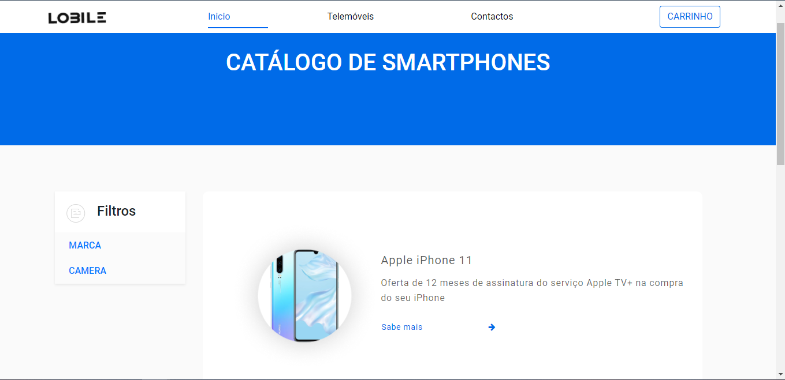

# C2 : Interface do usuário

Lobite é um simples website para que o utilizador tenha tudo a distancia de um clique, tudo com muita facilidade e rapidez. Foram usadas cores neutras para apelar ao utilizador e auxiliar a atividade sensorial do utilizador.

### Wireframes

Nas seguintes imagens, estão apresentadas o suposto website final na visão do utilizador

| |
:---:
 |
  Nesta imagem, está apresentada a pagina principal do website, contem alguns equipamentos que estao a venda no site. Contem uma seleção de filtros, para encontrar o equipamento mais facilmente que o utilizador deseja. No topo além de conter o carrinho de compras, que contem todos os artigos que o utizador deseja comprar, tambem existem mais dois opções que serão referidas a seguir. |

 
 

| |
:---:
 |
Na imagem a cima, serão apresentados todos os equipamentos que a loja oferece ao utilizador, sendo que irá mostrar as suas especificações, como a Marca, Nome, Tamanho ecrã, Memória RAM, Armazenamento, Número de Câmaras, Resolução da Câmara, Bateria e Preço.  |

 
 

| |
:---:
 |
Nesta imagem final, serve unicamente para o utilizador enviar as suas questões tanto como um equipamento como uma duvida que possa existir.  |

