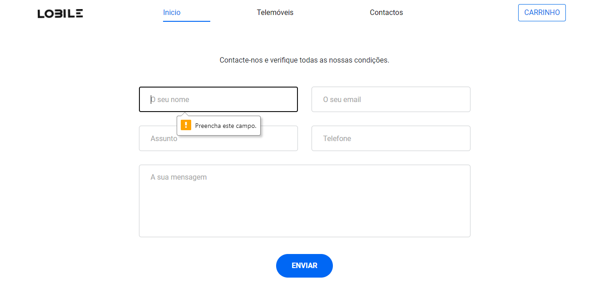
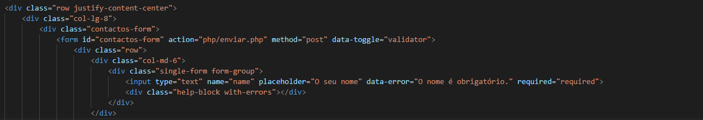
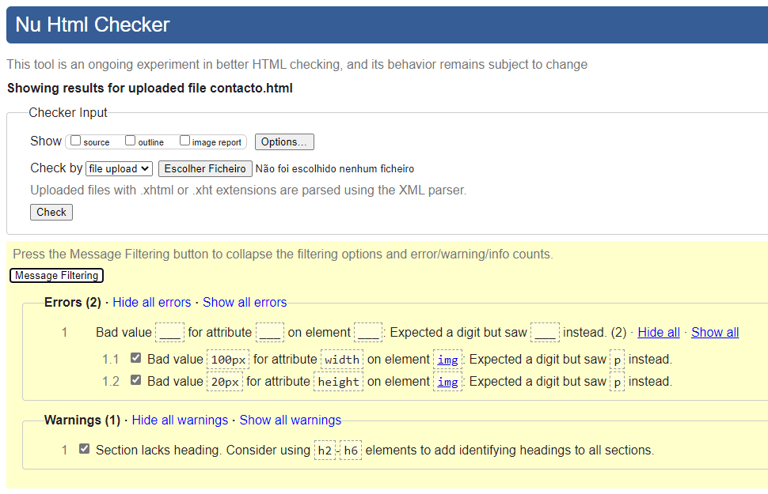
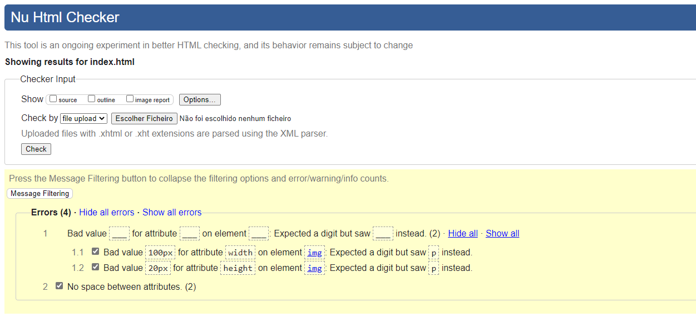
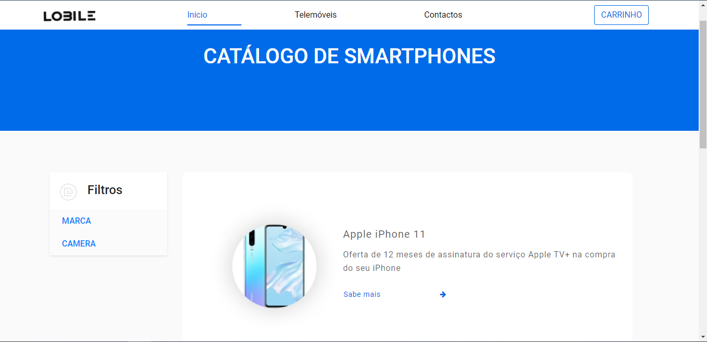
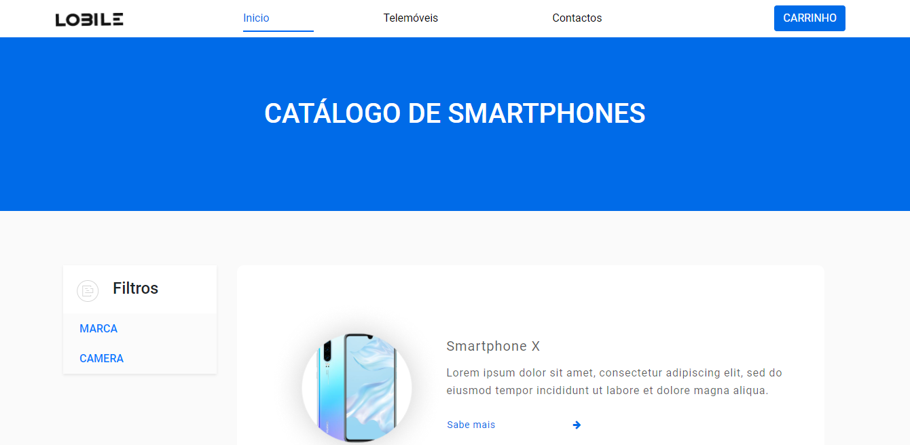
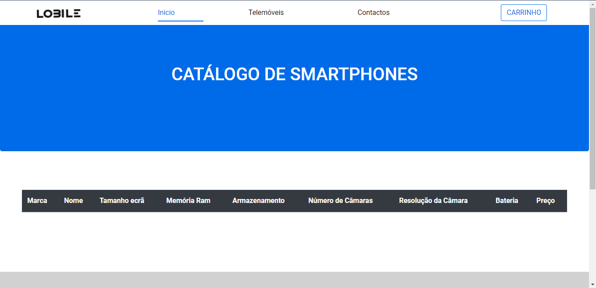
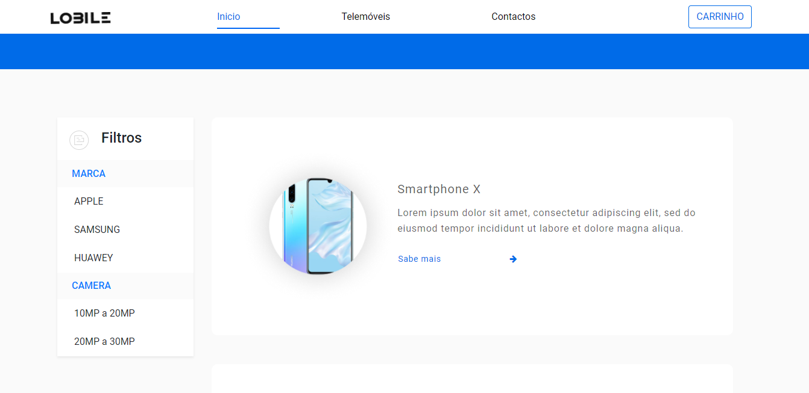

# C3 : Lobile

## 3.1 Instalação

Neste projeto foi usado o XAMPP, método que tornou extremamente fácil criar um servidor web local para fins de teste.

## 3.2 Uso

Nao tem nenhuma intrução necessária

## 3.3 Aplicação/Ajuda do Produto

  Lobile é um website simples, com cores neutras e facil navegação. A cor azul significa tranquilidade, serenidade, harmonia e espiritualidade, por isso foi uma das decisões para a escolha. Todo o website, está devidamente organizado e simplificado, para uma simples acesso sem qualquer complicação, tanto para os icones presentes como as diferentes paginas.

## 3.4 Forms

| | |
:---: | :---:
 | 
Um dos exemplos que iremos usar na questão dos Forms, será na parte dos contactos, pois estes tem a interação entre o utilizador e o website.| O formulário é usado para coletar entrada do usuário. Este faz a deteção se o campo nao cumprir com os requesitos minimos

## 3.5 HTML5 e CSS3 validação

Em todo o codigo validado, foi usado o https://validator.w3.org/ tanto para verificar o HTML como o CSS e reportar algum erro ou aviso que possa ter sucessido, com o afim de resolver a situação

| | |
:---: | :---:
 | 
Foi usado o W3C validator, em que apresenta 2 erros e 1 aviso no contacto.html|Foi usado o W3C validator, em que apresenta 4 erros no info.html

## 3.6 ‎Detalhes de implementação‎
 

Entre as duas imagens seguintes pode-se reparar que o botão CARRINHO tem uma ação, que depois do utilizador colocar o cursor em cima, o mesmo muda a cor para azul
| | |
:---: | :---:
 | 

 
 

Nas seguintes imagens, na questão dos Filtros, quando o utilizador selecionar a MARCA ou a CAMERA esta irá disponibilizar uma lista com certas especificações que na qual irá ajudar o utilizador na pesquisa do produto desejado
| | |
:---: | :---:
 | 

